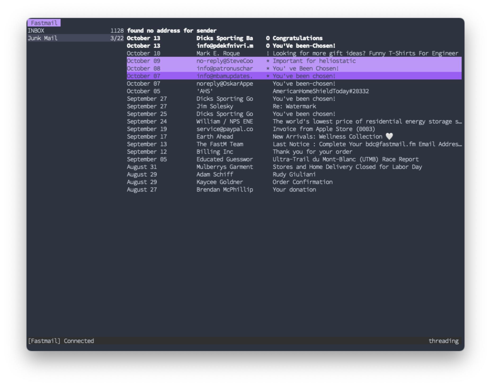
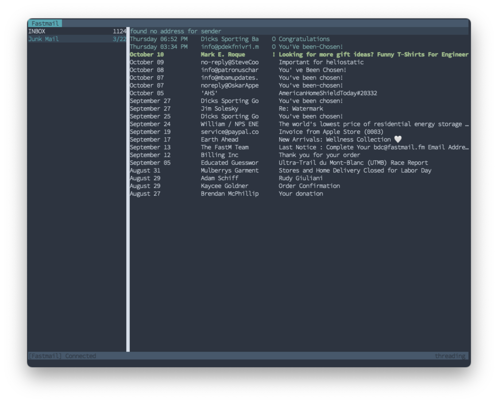

# Installation

To use a style set in aerc, set the `styleset-name` in your aerc configuration.
For more information about how style sets, refer to the manpage for
[`aerc-stylesets(7)`](https://git.sr.ht/~rjarry/aerc/tree/master/item/doc/aerc-stylesets.7.scd).

# Style Sets

## Dracula

[Dracula Style Set](https://git.sr.ht/~rjarry/aerc/tree/wiki/item/configurations/stylesets/dracula)

## Nord

[Nord Style Set](https://git.sr.ht/~rjarry/aerc/tree/wiki/item/configurations/stylesets/nord)

