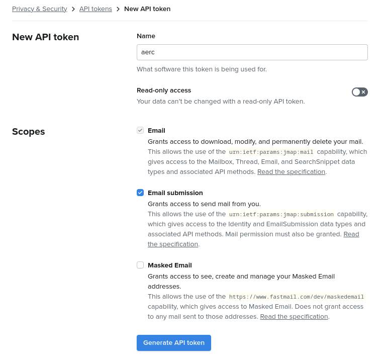
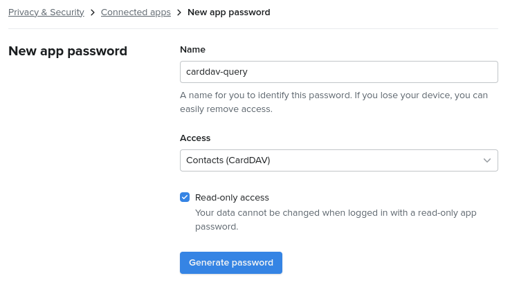

# Fastmail

If you have a Fastmail account, it is strongly recommended that you configure
it with JMAP. It will be much faster and reliable than IMAP.

The first thing you need to do is connect to your Fastmail account via a web
browser and generate an OAUTH API token for aerc:

https://app.fastmail.com/settings/security/tokens/new



Copy the generated token and store it somewhere safe.

Then, you can follow the new account wizard and select the following details:

## New account

Run `:new-account` from aerc. Fill in the name of the account, your name and
email address. Note that Fastmail allows you to use your own domain name. As
long as the email address has been configured in fastmail and is able to send
email, you can configure it in aerc.

```
Name for this account? (e.g. 'Personal' or 'Work')
> fastmail

Full name for outgoing emails? (e.g. 'John Doe')
> John Doe

Your email address? (e.g. 'john@example.org')
> john@fm.com
```

## Configure email source

Select JMAP and SSL/TLS+OAUTHBEARER. The username does not matter, you should
empty it. Paste the generated OAUTH token in the password field. If the server
address is empty (not automatically discovered via SRV DNS records), make sure
to input `api.fastmail.com/.well-known/jmap` into it.

```
Protocol
  [IMAP]     [JMAP]     [Maildir]     [Maildir++]     [notmuch]
             ^^^^^^
Username
>

Password
] ********************************

Server address (or path to email store)
> api.fastmail.com/.well-known/jmap

Transport security
  [SSL/TLS]  [SSL/TLS+OAUTHBEARER]  [SSL/TLS+XOAUTH2]  [STARTTLS]  [Insecure]
             ^^^^^^^^^^^^^^^^^^^^^
Connection URL
  jmap+oauthbearer://*******@api.fastmail.com/.well-known/jmap
```

## Configure outgoing mail

Empty all fields here. Simply select JMAP and SSL/TLS. It will instruct aerc to
reuse the credentials you provided for the email source.

```
Protocol
  [SMTP]     [JMAP]     [sendmail]
             ^^^^^^
Username
>

Password
]

Server address (or path to sendmail)
>

Transport security
  [SSL/TLS]     [SSL/TLS+OAUTHBEARER]     [SSL/TLS+XOAUTH2]     [STARTTLS]     [Insecure]
  ^^^^^^^^^
Connection URL
  jmap://

Copy sent messages to folder (leave empty to disable)
>
```

## Verification

Once you complete the wizard, you should see your inbox appearing. Open your
`~/.config/aerc/accounts.conf` file and check that it looks like the following:

```ini
[fastmail]
source      = jmap+oauthbearer://:************@api.fastmail.com/jmap/session
outgoing    = jmap://
default     = INBOX
from        = John Doe <john@fm.com>
use-labels  = true
cache-state = true
cache-blobs = false
```

Some settings should be changed immediately so that the inbox folder is on top
and selected by default:

```ini
folders-sort = Inbox
default = Inbox
```

## Extra settings

It is recommended to enable some settings for a better experience:

```ini
cache-blobs = true
```

## Address book

Fastmail provides a CardDAV access to your address book contacts. You can use
it directly in aerc via the `carddav-query` tool.

For this, you must first generate an app password with read-only CardDAV access:

https://app.fastmail.com/settings/security/apps/new



Copy the app password and paste it into your `accounts.conf` file:

```ini
# change "address%40fastmail.com" with your fastmail account email address
carddav-source = https://address%40fastmail.com@carddav.fastmail.com/dav/addressbooks/user/address@fastmail.com/Default
carddav-source-cred-cmd = echo $app_password
# change "fastmail" with your account name
address-book-cmd = carddav-query -S fastmail %s
```
